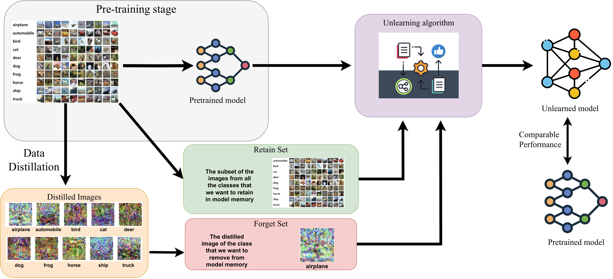
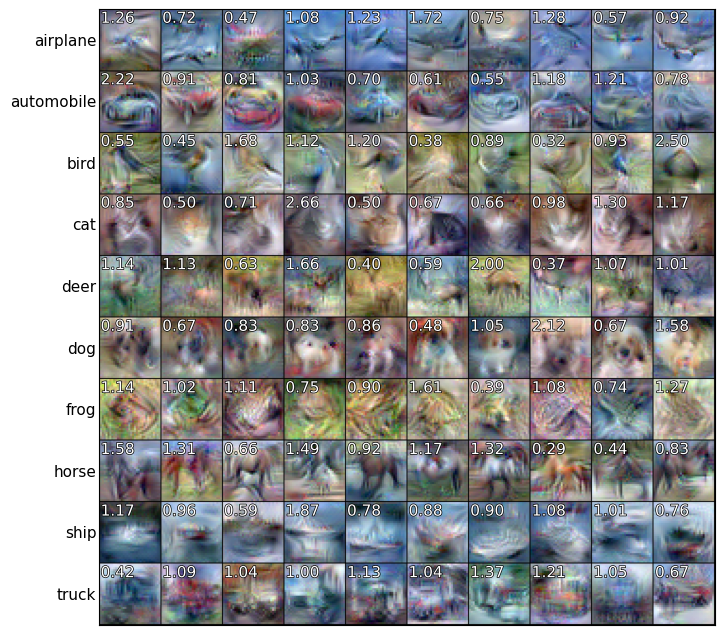

# Machine Unlearning with Weighted Data Distillation (MU-WDD)

The following codebase supplements the paper [*"Machine Unlearning with Weighted Data Distillation"*](https://www.overleaf.com/read/mwtdcjkzbqcy#7066cf).



We conduct experiments to investigate the following research questions:
1. Can data distillation be leveraged for machine unlearning?
2. How does machine unlearning with data distillation compare to standard machine unlearning?

The experiments involve an ablation study on unweighted and weighted data distillation, and on two unlearning techniques using the CIFAR10 and SVHN datasets (see our [paper](https://www.overleaf.com/read/mwtdcjkzbqcy#7066cf) for more). 



## Get Started with an Example: Commands to take you through the MU-WDD Pipeline

### Step 1: Download Pretrained Model 
Download a pretrained ResNet18 model on CIFAR10 from HuggingFace [here](https://huggingface.co/edadaltocg/resnet18_cifar10). 

### Step 2: Weighted Data Distillation
Run the following commands from `tesla` to get the expert trajectories (first command) and run the distillation process (second command). 

```shell
python buffer.py --dataset=CIFAR10 --model=ConvNetD3 --train_epochs=50 --num_experts=100 --zca
```
```shell
python distill.py --dataset=CIFAR10 --ipc=1 --syn_steps=50 --expert_epochs=2 --max_start_epoch=45 --lr_img=1000 --lr_lr=1e-07 --lr_teacher=0.01 --lr_weights=0.01 --data_path <PATH> --zca --model=ConvNetD3
```

### Step 3: Unlearning with Fine-tuning and Gradient Ascent
Run the following commands from `unlearn` for your method of choice (`-- unlearn FT` for fine-tuning or `-- unlearn GA` for gradient ascent)

```shell
python main_forget_distill.py --mask resnet18_cifar10.pth --unlearn FT --unlearn_lr 0.01 --unlearn_epochs 10 --class_to_replace <CLASS> --dataset cifar10
```

```shell
python main_forget_distill.py --mask resnet18_cifar10.pth --unlearn GA --unlearn_lr 0.0001 --unlearn_epochs 5 --class_to_replace <CLASS> --dataset cifar10
```
